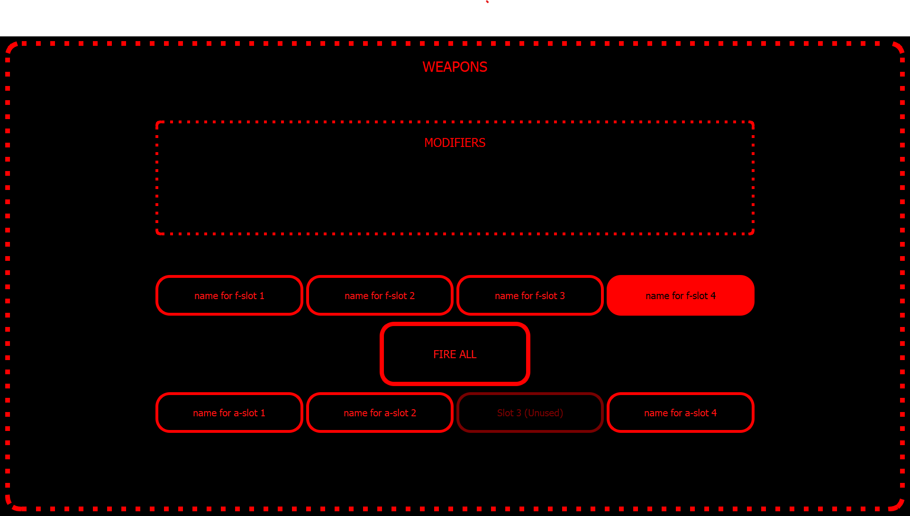

# STO_ECS - *Star Trek Online Embedded Control System*

STO_ECS is an independent project to create an embedded control system to liven the gameplay experience of the [Star Trek Online](https://www.arcgames.com/en/games/star-trek-online/).

### VISION:
The end-goal of this project is to physically emulate a Star-Trek-like space exploration and combat experience through integrated digital control panels within a space-ship-like vehicle. The user will be able to view and control the status of their ship through these interfaces.

Inspiration is drawn partially from others' projects such as [*this*](https://www.sunnyskyz.com/blog/1493/Dad-Builds-His-Son-A-Spaceship-Bed-With-The-Most-AMAZING-Control-Panel-I-ve-Ever-Seen) and [*this*](https://makezine.com/2017/07/05/this-dad-goes-above-beyond-space-ship-bunk-bed-build/). The central difference between these examples and this project is that it will be fully interactive - that is, users' inputs have real consequences in-game and game events produce consequences within the system's state.

### STATUS:
STO_ECS is very immature at this stage. It only has one GUI component with a limited number of actions. There are buttons to fire several weapons. Each button triggers a sound and emulates some particular keyboard key press.

Things like button labels, the number of buttons, and application graphical focus are static as of now, meaning that the names and number of buttons are not being pulled from the game and key presses are local to the application currently in focus. There is also a modifiers section that is not populated. These are some things to do next.

### SETUP:
- `git clone https://github.com/holychowders/sto_ecs.git`
- `cd sto_ecs`

- Optional:  
  - Create a virtual environment `virtualenv venv`
  - Activate your environment `source venv/Scripts/activate`

- `pip install -r requirements.txt`
- `python sto_ecs.py`

Depending on what you want to test, you can download [Star Trek Online](https://www.arcgames.com/en/games/star-trek-online/) (you can use Steam if you want to), but this won't do much for you right now.

       
*Note: I am NOT affiliated with the developers or publishers of this [game](https://en.wikipedia.org/wiki/Star_Trek_Online). This is an independent project purely for learning and enjoyment purposes.*
